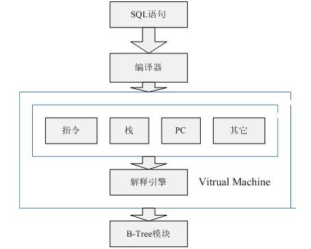
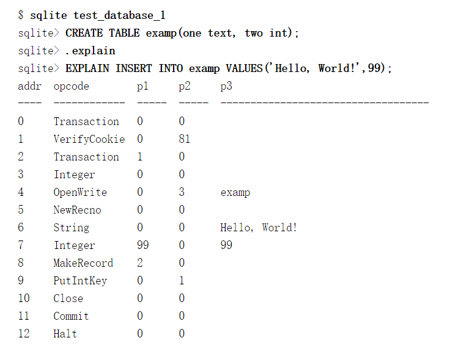
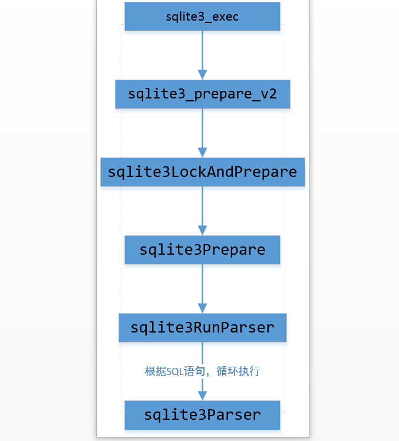
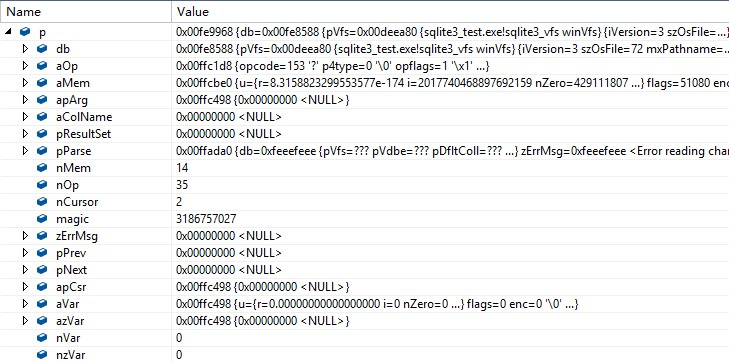

VDBE全称为虚拟数据库引擎(virtual database engine)，它是对真实计算机资源环境的一个抽象。它的原理类似于Java中的JVM（java虚拟机）和.NET平台的CLR（公共语言运行库），它们实现了这两种语言跨平台性。

## sqLite为什么要使用虚拟机

+ 跨平台（个人理解）

流程：

1.将SQL语句编译为虚拟机指令 

2.虚拟机执行指令（调用B-tree相关的接口）

sqLite会根据不同平台实现虚拟机，例如根据Android和iOS平台实现虚拟机的功能。VDBE有自己完善的硬体架构，如处理器、堆栈、寄存器等，还具有相应的指令系统，VDBE屏蔽了与具体操作系统平台相关的信息，使得程序只需生成在虚拟机上运行的目标代码（字节码），就可以在多种平台上不加修改地运行。

B树的主要工作是实现数据库文件的存储。它将所有的页面以树形结构组织起来,高度优化了索引查找机制。页面缓存服务于B树,主要负责传输以及提高工 作的效率,在磁盘上以B树形式传输页面。

## VDBE的运行



aOp数组保存有SQL经过编译后生成的所有指令。指令计数器(PC)每一个vdbe都有一个程序计数器，用来保存初始的计数器值。经过编译器生成的vdbe指令最终都是由解释引擎解释执行的.



上图是一个SQL语句在通过命令成成的字节码指令。在指令中可以看到Transaction指令表示开始一个事务，Commit或Rollback结束一个事务，VerifyCookie检验数据库模式的版本等等。 OpenWrite指令在P1（这儿为0）上即examp表上打开一个读写指针。

备注：B-tree和pager的使用 sqLite的数据都存放在数据库页当中。数据库页当中存储着大量信息（包括记录，字段和索引等）。B-tree负责将页组织为树状结构，方便搜索。Pager根据B-tree的要求对磁盘进行读写操作。（另一种说法：每一个B-tree都对应一个表或者索引。） 总之，每一条SQL语句都会被编译为一系列操作码供VDBE执行。

## VDBE执行方法

vdbe.c文件中存放着VDBE的执行方法（sqlite3VdbeExec），这是VDBE的核心，也是SQLite的核心，SQL解析器生成一个程序然后由VDBE执行SQL语句的工作。VDBE程序在形式上类似于汇编语言。VDBC程序由一系列线性操作组成，每个操作都有1个操作码和5个操作数，操作数P1,P2,P3是整数，操作数P4是一个以null结尾的字符串，操作数P5是一个无符号字符。sqlite3VdbeExec函数用于解析VDBE程序指令,但 是要建立一个程序指令还需要其它文件里的函数的帮助和支撑。 下面是sqlite3VdbeExec函数的说明：

```c
int sqlite3VdbeExec( Vdbe *p) 
{                    /* The VDBE */
      int pc=0;                  /* 程序计数器 */
      Op *aOp = p->aOp;          /* p->aOp的复本 */
      Op *pOp;                   /* 当前操作码 */
      int rc = SQLITE_OK;        /* 函数返回值 */
      sqlite3 *db = p->db;       /* 数据库 */
      Mem *aMem = p->aMem;       /* p->aMem的复本 */
      Mem *pIn1 = 0;             /* 第一次输入的参数 */
      Mem *pIn2 = 0;             /* 第二次输入的参数 */
      Mem *pIn3 = 0;             /* 第三次输入的参数 */
      Mem *pOut = 0;             /* 输出的参数 */
      int iCompare = 0;          /* 存放操作码OP_Compare的操作结果 */
      int *aPermute = 0;         /* 操作码OP_Compare使用的数组 */
      sqlite3VdbeEnter(p);       /* 初始化虚拟机程序p的环境 */
      p->rc = SQLITE_OK;
      p->pResultSet = 0;
      db->busyHandler.nBusy = 0;
      CHECK_FOR_INTERRUPT;
      sqlite3VdbeIOTraceSql(p);
      for (pc=p->pc; rc==SQLITE_OK; pc++)
      {
          pOp = &aOp[pc]; /* 取出指令 */
          if (pOp->opflags & OPFLG_OUT2_PRERELEASE) {
          	assert(pOp->p2>0 );
          	assert(pOp->p2<=p->nMem);
          	pOut = &aMem[pOp->p2];
          	memAboutToChange(p, pOut);
          	VdbeMemRelease(pOut);
          	pOut->flags = MEM_Int;
          }
          switch (pOp->opcode) {
            // switch语句,每一个case都是在VDBE里执行一个单独的指令，一共155个。
            // ……
         }
}
```


## 例子

为了对SQLite执行过程有一个更清晰的认识，我们使用接口部分提供的API函数，编写了一段基本的数据库操作代码，在visual studio环境下，结合着八个模块的顺序进行单步调试，在sqlite3VdbeExec函 数体内，我们也看到了switch语句的传值为pOp->opcode，所以我们重点观察opcode的生成过程和VDBE核心函数sqlite3VdbeExec的执行过程，代码如下：

```c
int main()
{
    sqlite3 *db = NULL;
    int result;
    result = sqlite3_open("test.db", &db);
    if (SQLITE_OK != result)
    {
        printf("Create/Open test.db error! \n");
    }
    printf("Create/Open test.db success!! \n");

    const char *sqlStr1 = "create table table2(sid integer primary key not null,age string);";
    result = sqlite3_exec(db, sqlStr1, 0, 0, 0);
    if (SQLITE_OK != result)
    {
        printf("create table table1 error! \n");
        return 0;
    }
    printf("create table table1 success! \n");
    const char* sqlStr2 = "insert into table1() values(1,'name1');";
    result = sqlite3_exec(db, sqlStr2, 0, 0, 0);
    if (SQLITE_OK != result)
    {
        printf("insert table table1 error! \n");
        return 0;
    }
    printf("insert table table1 success! \n");
    sqlite3_close(db);
    return 0;
}
```

在代码中我们可以看到几个重要的API函数的调用(sqlite3_open、sqlite3_exec、sqlite3_close)，sqlite3_exec函数执行我们输入的SQL语句，这些语句包括表的创建和表数据的增删查改，下面就是我们 的调试过程：

1. 通过在result = sqlite3_exec(db, sqlStr1, 0, 0, 0)设置断点，进入sqlite3_exec函数体内部，通过下图4-1可以看到(db, sqlStr1, 0, 0, 0)已经传入：


2. 继续执行sqlite3_exec函数，由于中间过程非常复杂我们使用下图4-2表示从sqlite3_exec开始执行到opcode生成之前的过程，也就是准备阶段：



3. 在sqlite3RunParser函数中有分词器功能函数对SQL语句进行分析，分析到SQL语句中的create命令或者表名等，就会进入sqlite3Parser函数，去解析这个命令或者语句，由于我们使用的是create table命令，所以在解析器里会执行sqlite3StartTable函数，图4-3就是sqlite3StartTable函数参数 信息


从图中我们可以看到表名table1已经在pName1中，虚表、视图和临时表标识都为0，pParse中保存着被分析解释过的SQL语句。sqlite3StartTable函数的功能就是创建表，在函数体中通过调用sqlite3FindTable函数在main数据库中查找到这个表，然后创建了一个VDBE实例v，把OP_ReadCookie、OP_If、OP_Integer、OP_SetCookie、OP_CreateTable、OP_OpenWrite、OP_NewRowid、OP_Null、OP_Insert、OP_Close等然后执行sqlite3FinishCoding函数，并在sqlite3FinishCoding函数中创建了一个VDBE实例v，把操作符OP_Init、OP_Transaction、OP_TableLock、OP_Goto和OP_Halt添加到了v的aOp中，到此为止准备阶段结束，释放占用内存，清除各种结构，代码也从sqlite3_prepare_v2跳出。

4. 下面进入sqlite3_step函数，准备阶段处理好的VDBE实例v也被传入，而进入sqlite3Step后，就会调用VDBE处理函数sqlite3VdbeExec，这个时候v的结构如图4-4所示：



5. 进入sqlite3VdbeExec后，先进行一些变量的初始化和配置，下面进入到for循环中，pc为循环因子，初始为0。然后进入switch语句中，来执行之前生成的操作符。