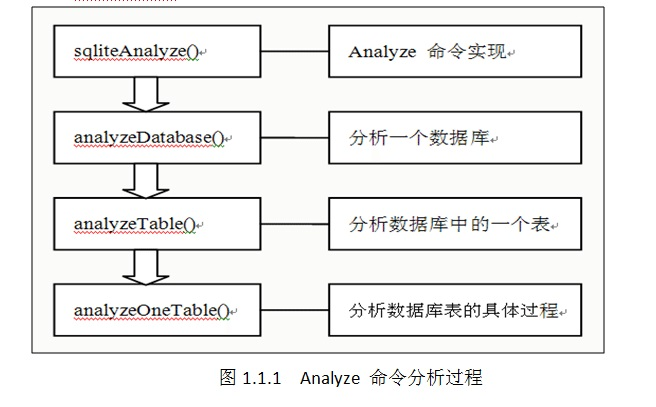
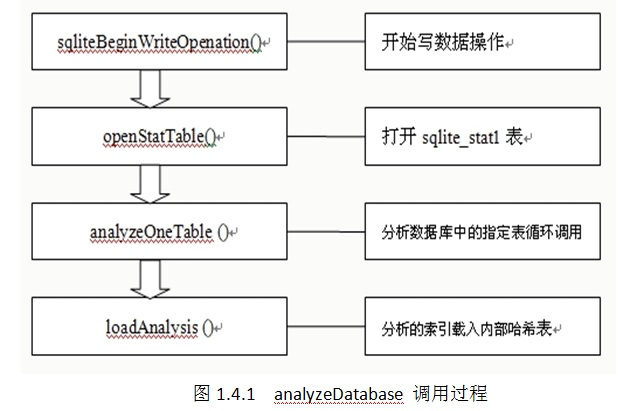
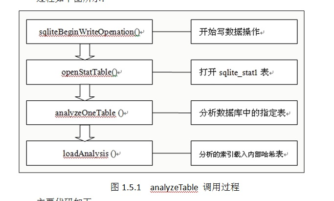

analyze.c主要用来处理SQL语句。
# Analyze的SQL语法
```c
sql-statement ::= 	ANALYZE
sql-statement ::= 	ANALYZE database-name
sql-statement ::= 	ANALYZE [database-name .] table-name
```

ANALYZE命令集合关于索引的统计信息并将它们储存在数据库的一个特殊表中，查询优化器可以用该表来制作更好的索引选择。 若不给出参数，所有附加数据库中的所有索引被分析。若参数给出数据库名，该数据库中的所有索引被分析。若给出表名 作参数，则只有关联该表的索引被分析。

最初的实现将所有的统计信息储存在一个名叫sqlite_stat1的表中。未来的加强版本中可能会创建名字类似的其它表， 只是把"1"改为其它数字。sqlite_stat1表不能够被撤销，但其中的所有内容可以被删除，这是与撤销该表等效的行为。

# Analyze 命令接口
## 2.1 生成ANALYZE命令代码

```c
void sqlite3Analyze(Parse *pParse, Token *pName1, Token *pName2)
```

解析器调用这个例程当它识别ANALYZE命令。生成ANALYZE命令代码。

格式1：ANALYZE
格式2：ANALYZE database-name
格式3：ANALYZE [database-name ] table-name
格式1：所有附加数据库中的所有索引被分析。
格式2：若参数给出数据库名，该数据库中的所有索引被分析。
格式3：若给出表名 作参数，则只有关联该表的索引被分析。

## 2.2 sqlite3Analyze接口的关键代码及工作流程
```c
assert( sqlite3BtreeHoldsAllMutexes(pParse->db) );
  if( SQLITE_OK!=sqlite3ReadSchema(pParse) ){
    return;
  }
```
（1）读取数据库的模式schema.如果有错误发生,保留一个错误信息

（2）解析器中的代码，并返回空。

第一种情况主要代码：
```c
  if (pName1 == 0) 
  {
    for (i = 0; i < db->nDb; i++) 
    {
		if (i == 1) continue;
		analyzeDatabase(pParse, i);
    }
  }
```
当第一个参数pName1为0时，此时为格式1，需要分析所有。当i==1时为TEMP数据库不需要分析，直接跳过。其余的调用analyzeDatabase接口完成分析。

第二种情况分支代码：
```c
else if (pName2->n == 0)
{
    iDb = sqlite3FindDb(db, pName1);
    if (iDb >= 0) 
    {
      analyzeDatabase(pParse, iDb);
    } 
    else 
    {
      z = sqlite3NameFromToken(db, pName1);
      if (z) 
      {
        if ((pIdx = sqlite3FindIndex(db, z, 0))!=0) 
        {
          analyzeTable(pParse, pIdx->pTable, pIdx);
        }
        else if ((pTab = sqlite3LocateTable(pParse, 0, z, 0))!=0 )
        {
          analyzeTable(pParse, pTab, 0);
        }
        sqlite3DbFree(db, z);
      }
    }
  }
```
当第一个参数不为0，而第二个参数为0时，此时符合格式2,需要对给定的数据库进行分析，先调用sqlite3FindDb查找给定的pName1数据库，如果查找成功，则调用analyzeDatabase分析数据库。如果查找不成功，则通过pName给定的数据库分析表。

第三种格式代码：
```c
else
{
    iDb = sqlite3TwoPartName(pParse, pName1, pName2, &pTableName);
    if (iDb>=0)
    {
      zDb = db->aDb[iDb].zName;
      z = sqlite3NameFromToken(db, pTableName);
      if (z)
      {
        if ((pIdx = sqlite3FindIndex(db, z, zDb)) != 0)
        {
          analyzeTable(pParse, pIdx->pTable, pIdx);
        }
        else if ((pTab = sqlite3LocateTable(pParse, 0, z, zDb)) != 0)
        {
          analyzeTable(pParse, pTab, 0);
        }
        sqlite3DbFree(db, z);
      }
```
不是前面两种情况即为第三种格式，此时只分析完全符合的表。其中用到analyzeTable接口在后面介绍。过程如下图：


# analyzeDatabase函数
## 3.1函数头

函数原型为：
```c
static void analyzeDatabase(Parse *pParse/*参数1为解析上写文*/
, int iDb/*参数2指定分析的数据库*/
)
```
该接口负责对给定的数据库进行全部的分析。在sqlite3Analyze中调用。

## 3.2函数流程

过程如下图所示：

其中分析数据库要反复执行图1.4.1中第三步，去分析数据库中的每一个表。

主要代码如下：
```c
  sqlite3BeginWriteOperation(pParse, 0, iDb)
  iStatCur = pParse->nTab;
  pParse->nTab += 3;
  openStatTable(pParse, iDb, iStatCur, 0, 0);
  iMem = pParse->nMem+1;
  assert( sqlite3SchemaMutexHeld(db, iDb, 0) );

  for(k=sqliteHashFirst(&pSchema->tblHash); k;

  k=sqliteHashNext(k))
  {

    Table *pTab = (Table*)sqliteHashData(k);

    analyzeOneTable(pParse, pTab, 0, iStatCur, iMem);
  }
  loadAnalysis(pParse, iDb);
}
```
对一个数据库进行分析要先通过openStatTable打开系统的sqlite_stat表，然后对数据库中的每一个表进行分析，通过analyzeOneTable来完成。最后调用loadAnalysis。用到的几个函数后面会介绍。

# analyzeTable函数
## 4.1函数原型
```c
static void analyzeTable(Parse *pParse, Table *pTab, Index *pOnlyIdx)
```
参数1：解析上下文，参数2：pTab要分析的表，参数3：该索引是否为是表的唯一索引

函数的功能：对数据库中的一个表进行分析，如果参数pOnlyIdx不为空那么这个表中的唯一索引将被分析。

## 4.2函数流程

过程如下图所示：

主要代码如下：

```c
  assert( pTab!=0 );
  assert( sqlite3BtreeHoldsAllMutexes(pParse->db) );
  iDb = sqlite3SchemaToIndex(pParse->db, pTab->pSchema);
  sqlite3BeginWriteOperation(pParse, 0, iDb);
  iStatCur = pParse->nTab;
  pParse->nTab += 3;

  if (pOnlyIdx) 
  {
    openStatTable(pParse, iDb, iStatCur, pOnlyIdx->zName, "idx");
  }
  else
  {
    openStatTable(pParse, iDb, iStatCur, pTab->zName, "tbl");
  }
  analyzeOneTable(pParse, pTab, pOnlyIdx, iStatCur, pParse->nMem+1);

  loadAnalysis(pParse, iDb);
```

附加了一些判断，不合法的情况以及互斥锁等等其真正实现分析表的是analyzeOneTable。

最后调用loadAnalysis把最近使用的索引写入hash表中，以便以后方便使用。

# loadAnalysis函数
```c
static void loadAnalysis(Parse *pParse, /* 解析器上下文 */
						 int iDb/*指定分析的数据库*/
)
```
生成的代码会导致大多数最近分析的索引将被加载到内部hash表，这样比较便于使用。

# analyzeOneTable函数
真正实现分析一个单一表所关联的所有索引。

## 5.1 函数原型

该函数的原型如下：
```c
static void analyzeOneTable(
  Parse *pParse,   /* 解析器上下文 */
  Table *pTab,     /* 要分析的表 */
  Index *pOnlyIdx, /* 如果为空, 只分析这一个索引 */
  int iStatCur,    /* VdbeCursor的索引用于写sqlite_stat1 表 */
  int iMem         /*从次可用的内存 */
)
```
## 5.2函数中用到的变量注释

该函数中主要用到的一些变量的注释：
```c
sqlite3 *db = pParse->db;    /*数据库句柄 */
  Index *pIdx;                 /* 一个正在被分析的索引*/
  int iIdxCur;                 /* 打开的正在被分析的索引的下标*/
  Vdbe *v;                     /*建立的虚拟机 */
  int i;                       /*循环计数 */
  int topOfLoop;               /* 循环的开始 */
  int endOfLoop;               /* 循环的结束 */
  int jZeroRows = -1;          /* 如果组数为0从此跳转*/
  int iDb;                     /* 数据库包含的表的索引*/
  int regTabname = iMem++;     /* 记录器包含的表名 */
  int regIdxname = iMem++;     /* 记录器包含的索引名 */
  int regStat1 = iMem++;       /* sqlite_stat1表的stat列*/
  int regCol = iMem++;         /* 被分析的表中一列的内容 */
  int regRec = iMem++;         /* 记录器持有的完全记录 */
  int regTemp = iMem++;        /* 临时用到的记录器*/
  int regNewRowid = iMem++;    /* 插入记录的rowid*/
```
函数中有一个分析的循环体，这个循环体从索引b-tree的头运行到尾逐一处理。

最后将分析的结果存储在sqlite_stat1表中。如果表中没有索引则创建一个空的sqlite_stat1表。

# stat3Init函数，stat3Push函数，stat3Get函数
实现了stat3_init(C,S)

SQL功能，这两个参数分别是在表或者索引中的行数和累计的采样数。这个过程分配并初始化Stat3Accum 对象的每一个属性。返回值是 Stat3Accum 对象.

stat3Push实现了stat3_push(nEq,nLt,nDLt,rowid,P) SQL的功能，这些参数描述了一个关键字的实例。这个过程做出决定关于是否保留sqlite_stat3表的关键字。

stat3Get实现了stat3_get(P,N,...) SQL 语句功能的实现，用于查询结果。返回的是sqlite_stat3的第N行。N是在0 到 S-1之间，s是样本数。返回的值根据的是参数的值。

如
  argc==2    结果:  rowid

  argc==3    结果:  nEq

  argc==4    结果:  nLt

  argc==5    结果:  nDLt

# 其他用到的一些函数
## 8.1 打开sqlite_stat1表
```c
static void openStatTable(
  Parse *pParse,          /* 解析上下文*/
  int iDb,                /* 正在分析的数据库*/
  int iStatCur,           /* 打开 sqlite_stat1 表的游标 */
  const char *zWhere,     /* 删除这个表或索引的条目 */
  const char *zWhereType  /* "tbl" 或 "idx" */
)
```
## 8.2 工作流程

+	该函数的是用于打开sqlite_stat1表，在iStatCur游标位置进行写操作，如果库中有SQLITE_ENABLE_STAT3的宏定义，那么sqlite_stat3 表将被打开从iStatCur+1位置开始写。

+	如果sqlite_stat1表之前不存在并且库中以SQLITE_ENABLE_STAT3宏定义编译的，那么该表被创建。

+	参数zWhere可能是一个指向包含一个表名的缓存的指针，或者是一个空指针，如果不为空，那么所有在表sqlite_stat1和sqlite_stat3之中相关联的表的条目将被删除。

+	如果zWhere==0,那么将删除所有stat表中的条目。
