Build.c在SQLite中的位置.Build.c位于代码生成器中,处理同名SQL语句、SQL表达式代码生成之外的其它SQL语句的生成.

#  Build.c实现的功能
Build.c属于代码生成器部分,处理以下语法:

```sql
CREATE TABLE
DROP TABLE
CREATE INDEX
DROP INDEX

creating ID lists
BEGIN TRANSACTION
COMMIT
ROLLBACK
```

(1)表的创建
(2)表的删除
(3)索引的创建
(4)索引的删除
(5)视图的创建
(6)ID序列的创建
(7)ID序列的删除
(8)事务的开始
(9)事务的提交
(10)事务的回滚
用到的函数有如下所示:

```c
Sqlite3BeginParse
TableLock
Sqlite3NestedParse
Sqlite3LocateTable
freeIndex
Sqlite3ResetOneSchemal
Sqlite3StartTable
Sqlite3DeleteTable
Sqlite3AddColumn
Sqlite3AddCollateType
Sqlite3CreateView
Sqlite3ViewGetColumnNames
sqliteViewResetAll
Sqlite3RootPageMoved
destroyRootPage
Sqlite3CodeDropTable
Sqlite3DropTable
Sqlite3CreateForeignkey
Sqlite3DeferForeignkey
Sqlite3RefillIndex
Sqlite3CreateIndex
Sqlite3DropIndex
sqlite3IdListApped
Sqlite3IdListDelete
Sqlite3IdListIndex
Sqlite3BeginTransaction
Sqlite3CommitTransaction
Sqlite3RollbackTransaction
Sqlite3Savepiont
reindexTable
reindexDatabases
Sqlite3Reindex
```

# 表
## 表的创建
```c
void sqlite3StartTable(
Parse *pParse, /*解析上下文*/
Token *pName1, /*视图或表名称的第一部分*/
Token *pName2, /*视图或表名称的第二部分*/
int isTemp, /*如果这是一个TEMP表则true*/
int isView, /*如果这是一个视图则true*/
int isVirtual, /*如果是一个虚表则true*/
int noErr /*如果表已经存在,什么也不做*/
)
```
表在创建之前需要进行一系列机制的检查.
步骤如下:

(1)通过pName1找到数据库的索引,然后判断数据库是否存在,是否是临时的;

(2)通过pName2(表名)检查数据库中的表名是否合法,不合法返回,合法检查数据库中的角色是否有创建数据表的权限,有权限,就创建表.

(3)检查表/索引是否唯一,然后分配内存.这些内存是Table结构体的内存.

(4)对结构体进行初始化,如写表名、主键等.

流程图如图1-2所示.

以上的这些操作是在sqlite_master表中进行操作的,只加了一个占位符,不创建任何记录.真正的执行操的创建是在执行sqliteEndTable()后生成的,这样进行以后就会生成创建表的代码.
上面所进行的的操作是将创建表的框架搭建好,相当于将进行了create table{}操作.
检查机制进行完之后的操作如下所示:
添加列的约束机制,检查是否可以为空,然后添加列属性,但是在添加列的时候要进行其他的约束机制的检查,如列的总数是否达到最大值,列名是否有重名的.用到的函数有sqlite3NameFromToken(db,pName)和宏STRICMP(),宏的作用是比较两个字符串,不区分大小.然后使用函数sqlite3DbRealloc()分配内存.

对新增加的一列进行默认操作,使用p->nCol++对列的总数进行修改(+1).接着使用函数进行为空检查.使用函数sqlite3AddColumnType(Parse *pParse, Token *pType)

对新增加的一列添加属性,在使用函数sqlite3AddDefaultValue(Parse *pParse, ExprSpan *pSpan)添加默认值.通过函数
```c
void sqlite3AddPrimaryKey(
    Parse *pParse,
    ExprList *pList,
    int onError,
    int autoInc,     )
```
添加主键.接着进行创造check约束.函数如下:
```c
void sqlite3AddCheckConstraint(Parse *pParse, Expr *pCheckExpr)
```
通过函数
   void sqlite3AddCollateType(Parse *pParse, Token *pToken)增加排 对新增加的一列进行默认操作,使用p->nCol++对列的总数进行修改(+1).接着使用函数进行为空检查.使用函数sqlite3AddColumnType(Parse *pParse, Token *pType)  对新增加的一列添加属性,在使用函数sqlite3AddDefaultValue(Parse *pParse, ExprSpan *pSpan)添加默认值.

然后调用函数
```c
void sqlite3EndTable(
	Parse *pParse,
	Token *pCons,
	Token *pEnd,
	Select *pSelect  )
	Table *p;
    sqlite3 *db = pParse->db;

    int iDb;
};
```
进行了这些操作之后表就真正在内存中建立起来了.表的创建过程如下表的创建的结构:
```sql
Create table Student {
	int age;
	int id;
	char name;
}
```
表的创建的调试过程如下所示:
创建一个table2表

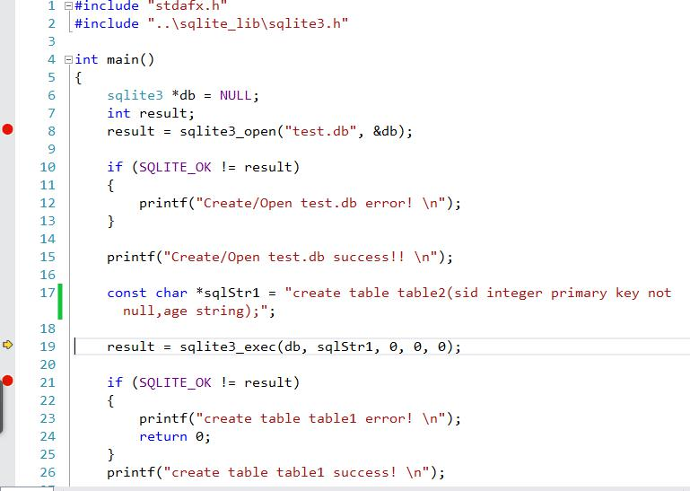

程序进去后首先执行


通过解析函数解析到需要建表,执行下面函数并且进入下面的函数


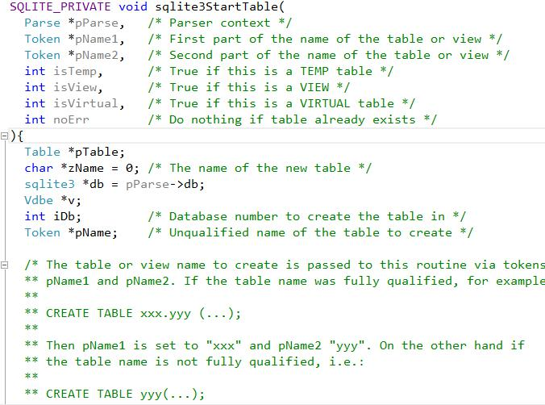

此函数执行流程:
第一:通过红色网方框中的函数把表名的第一部分赋值给pName返回数据库索引.进入此函数


此函数首先把pName1赋值给pName,第二pName1查找数据库索引(下图红的方框中).

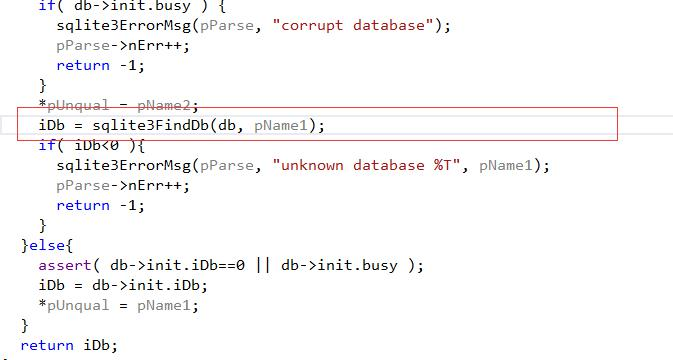

Sqlite3FindDb(db,pName1)完成此函数返回上一层函数sqlite3TwoPartName(pParse, pName1, pName2, &pName)中,完成后再返回上一级函数sqlite3StartTable中,继续执行.

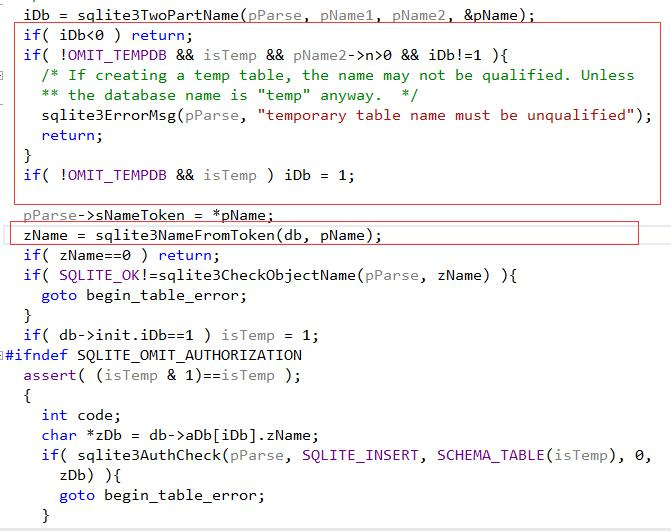

上图第一个红色方框中是对数据库的一些判断,判断数据库是否存在,是否为临时的.第二个红色方框是把token类型的pName转化为字符串(sqlite3NameFromToken()进入次函数如下图).

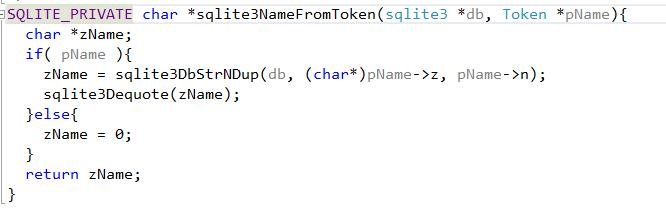

执行完图函数,继续执行原函数,如下图


红色方框中的函数是用来检查zName是否合格,进入此函数(如下图)

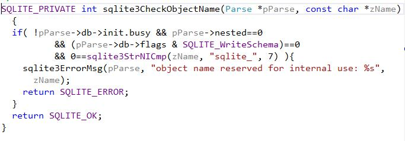

执行完图函数,继续执行原函数,如下图

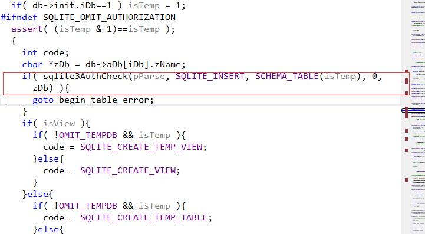

上图的红色方框是用来检测数据库是否有创建和添加权限

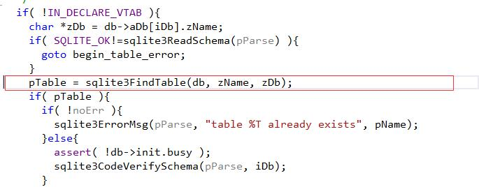

上图的红色方框是用来查找名为zName的表,进入此函数(如下图),功能是检测数据库是否已经存在相同的表.


执行完返回主函数

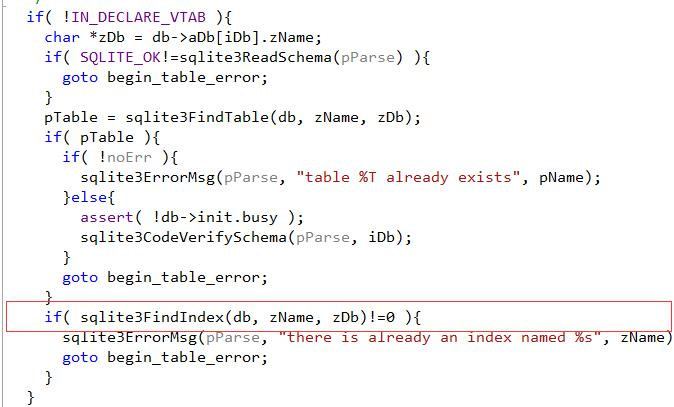

上图的红色方框是用来检测数据库中的索引的名字是否有zName.(进入此函数如下图)

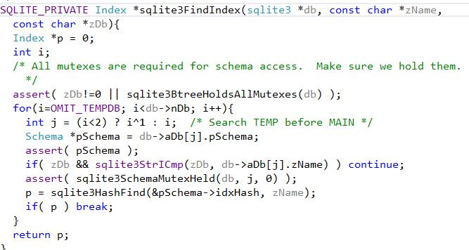

执行完返回主函数


上图为添加相关操作码.sqlite3StartTable()函数完成


上图添加列的属性(进入函数如下图)

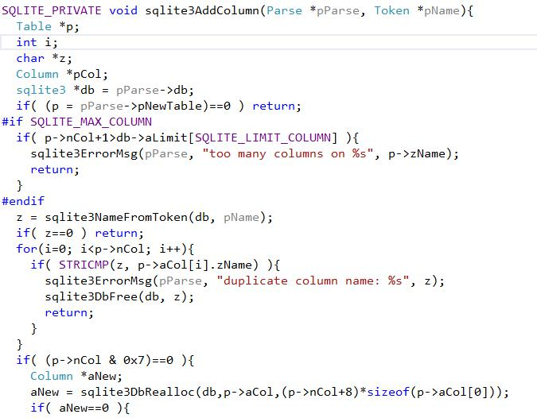

数据流程为:判断表的列数是否已达到最大,判断表中是否已经存在相同名字的列,分配内存,初始化,更改列的总数.添加一列完成.


上图为添加列的属性,进入函数如下

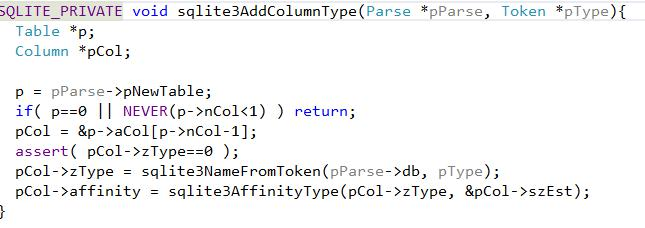

系统会自动的多添加3列,分别是tbl_Name,rootpage,sql这三列.


当列创建好了,就是执行下面的endTable.

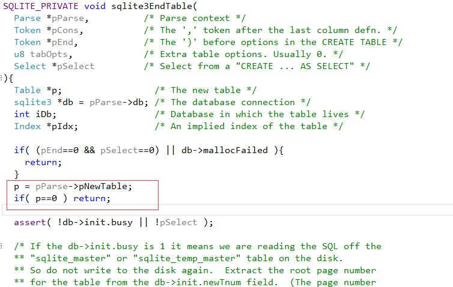

SQL语句被解析之后调用这个例程,为VDBE程序执行的语句做准备.为下一个parse重置pParse结构.

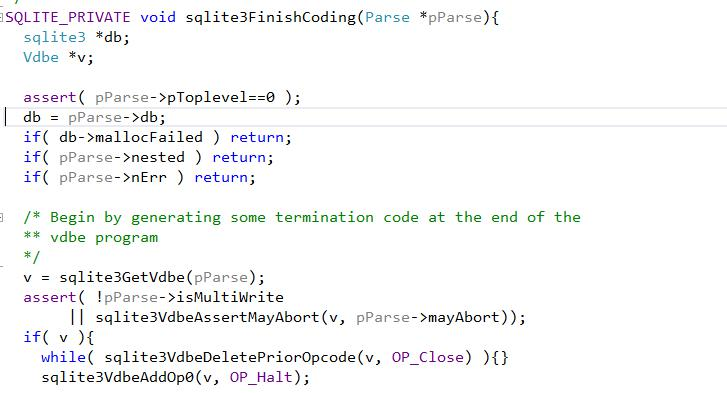

调试的流程图如下:


## 表的删除
在删除表之前首先要运行以下函数
```c
destroyRootPage(
Parse *pParse,//建立解析器
int iTable, //表索引
int iDb      //数据库索引
)
```
删除根页码的表,更新主表和内部模式.
```c
static void sqlite3ClearStatTables(
  Parse *pParse,      //解析上下文
  int iDb,         //创建数据的个数
  const char *zType,  //指向索引或表
  const char *zName //指向索引或表的的命名空间
)
```
运行删除索引或删除表的指令后从sqlite_statN表删除条目 .运行过以上两个函数之后开始运行函数.
```c
void sqlite3CodeDropTable(Parse *pParse, Table *pTab, int iDb, int isView)
{
  Vdbe *v;
  sqlite3 *db = pParse->db;
  Trigger *pTrigger;
  Db *pDb = &db->aDb[iDb];
}
```
生成删除表的指令.在这个函数中调用构建触发器列表,删除触发器,删除某个名称的表序列等方法,做好删除表的前期工作.紧接着运行函数
```c
void sqlite3DropTable(Parse *pParse, SrcList *pName, int isView, int noErr)
{
  Table *pTab;        //要删除的表
  Vdbe *v;           //虚拟数据库引擎
  sqlite3 *db = pParse->db;
  int iDb;
}
```
删除数据表.

## 外键
```c
 void sqlite3CreateForeignKey(
  Parse *pParse,       //解析上下文
  ExprList *pFromCol,  //创建这个表中指向另一表的列
  Token *pTo,          //创建新表的名字
  ExprList *pToCol,    //创建另一表的列指向
  int flags            //添加冲突解决算法的数目.
)
```
调用进程从当前正在建的表中创建一个新的外键约束.
`void sqlite3DeferForeignKey(Parse *pParse, int isDeferred)`对刚创建的外键做相应的调整.

## 表锁
```c
void sqlite3TableLock(
	Parse *pParse,     // 索引上下文
	int iDb,           // 索引数据库包含表的锁
	int iTab,          //根表的页码是锁着的
	u8 isWriteLock,    //对一个写入锁是true
	const char *zName  //加锁的表名
)
```
使用这个函数在表上建立写锁,并且调用遍历表的方法和表的约束方法.
`Table *sqlite3FindTable(sqlite3 *db, const char *zName, const char *zDatabase)`通过数据库名和表名找到table,然后返回Table.


# 索引
## 索引的创建
```c
Index *sqlite3CreateIndex(
  Parse *pParse,     //关于这个语法解析器的所有信息
  Token *pName1,   //索引名称的第一部分,这部分可能是空的.
  Token *pName2,    //索引名称的第二部分,可能是空的.
  SrcList *pTblName, //使用索引的表的名称
 pParse->pNewTable //这个表的索引,当为0时用
 pParse->pNewTable表示

  ExprList *pList,   //列索引的列表

  int onError,   //关于OE_Abort、OE_Ignore

  OE_Replace或OE_None的参数

  Token *pStart,    //CREATE指令开始这样的声明
  Token *pEnd,       //当出现)时关闭CREATE

  INDEX语句

  int sortOrder,     //当pList==NULL主键的排序顺序
  int ifNotExist   //如果索引已经存在忽略错误
)
```
创建一个SQL表的新索引.pName1.pName2是索引的名称,pTblList是表,该表将被编入索引名.两者都会是NULL的主键或建立满足UNIQUE约束的索引.如果PTABLE和pIndex为NULL,则使用pParse ->pNewTable为表建立索引.

pParse->pNewTable是当前正由一个CREATE TABLE语句构成的表.plist中的列的列表来进行索引.如果这是在最新的专栏中添加表目前正在建设一个主键或唯一约束,PLIST为NULL.如果索引创建成功,返回一个指针在新索引结构.这是使用的sqlite3AddPrimaryKey()来标记索引作为表的主键(Index.autoIndex==2).

索引建立的实现过程如下:

(1)查找数据库是否存在,不存在直接返回

(2)检查表.如果索引的名字是不合格的,则检查表是否是一个临时表

(3)找出索引的名称,确保这里没有其他的索引或同样的索引名称

(4)创建一个假的列表来进行模拟这一操作

(5)找出需要存储多少字节的空间,显示指定序列的名称

(6)分配索引结构

(7)检查一下看看我们是否应该将请求的索引列进行将序排列

(8)扫描表中列的索引的名称,加载列指数到列索引结构中.

(9)添加一个测试,以确保相同的列不会被命名在相同的索引上

(10)定义排序序列的名称

(11)创建一个自动索引,这个自动索引作为主键或唯一子句的列定义,或者是后来的主键或唯一子句的列定义.

(12)链接新的索引结构和其它的内存数据库结构,如果db->init.busy为0,那么在硬盘上创建索引.

(13)创建的rootpage索引

(14)收集CREATE INDEX语句的完整文本到zStmt变量中

(15)在sqlite_master索引中添加一个入口

(16)填充这一索引的数据,然后重新解析模式.

(17)退出清空缓存

(18)完成索引的创建

假定我们有一个简单的表dummy:

```sql
CREATE TABLE "dummy" (
  "int" real,
  "string" TEXT
);
```

我们简单来分析一下,如果在dummy表上插入一条索引,会生成什么样的代码:

```sql
EXPLAIN CREATE INDEX idx1 ON dummy ( string );
sqlite> EXPLAIN CREATE INDEX idx1 ON dummy ( string );
addr  opcode         p1    p2    p3    p4             p5  comment      
----  -------------  ----  ----  ----  -------------  --  -------------
0     Init           0     33    0                    00  Start at 33  # 跳转到指令33去执行
1     Noop           0     32    0                    00
2     CreateBtree    0     1     2                    00  r[1]=root iDb=0 flags=2
3     OpenWrite      0     1     0     5              00  root=1 iDb=0; sqlite_master # 打开sqlite_master表
4     String8        0     3     0     index          00  r[3]='index' 
5     String8        0     4     0     idx1           00  r[4]='idx1'  
6     String8        0     5     0     dummy          00  r[5]='dummy' 
7     SCopy          1     6     0                    00  r[6]=r[1]    
8     String8        0     7     0     CREATE INDEX idx1 ON dummy ( string ) 
                                                          00
														  r[7]='CREATE INDEX idx1 ON dummy ( string )'
9     NewRowid       0     2     0                    00  r[2]=rowid   
10    MakeRecord     3     5     8     BBBDB          00  r[8]=mkrec(r[3..7])   # 生成一条记录
11    Insert         0     8     2                    18  intkey=r[2] data=r[8] # 插入sqlite_master表
12    SorterOpen     3     0     1     k(2,,)         00                        # 接下来开始往索引中填充数据
13    OpenRead       1     2     0     2              00  root=2 iDb=0; dummy   # 打开dummy表
14    Rewind         1     20    0                    00                        # 跳转到第1条记录
15    Column         1     1     10                   00  r[10]=dummy.string    # 获取string列的数据
16    Rowid          1     11    0                    00  r[11]=rowid  
17    MakeRecord     10    2     9                    00  r[9]=mkrec(r[10..11]) # 生成记录
18    SorterInsert   3     9     0                    00  key=r[9]              # 往sorter中插入记录
19    Next           1     15    0                    00  # 让游标指向下一个值,如果游标没有指向最后一条记录,虚拟机跑到15处执行,
                                                          # 否则执行下一条指令
20    OpenWrite      2     1     0     k(2,,)         11  root=1 iDb=0         
21    SorterSort     3     26    0                    00
22    SorterData     3     9     2                    00  r[9]=data  # 读取数据,放入寄存器9
23    SeekEnd        2     0     0                    00
24    IdxInsert      2     9     0                    10  key=r[9]   # 往索引表中插入数据  
25    SorterNext     3     22    0                    00  # 让sorter指向下一条记录,如果sorter没有指向最后一条记录,虚拟机跑到22
                                                          # 处继续执行,否则执行下一条指令
26    Close          1     0     0                    00
27    Close          2     0     0                    00
28    Close          3     0     0                    00
29    SetCookie      0     1     2                    00
30    ParseSchema    0     0     0     name='idx1' AND type='index'  
                                                      00
31    Expire         0     1     0                    00
32    Halt           0     0     0                    00
33    Transaction    0     1     1     0              01  usesStmtJournal=1 # 打开日志
34    Goto           0     1     0                    00                    # 跳转到指令1去执行
```

## 索引的删除

使用函数```sqlite3DropIndex(Parse *pParse, SrcList *pName, int ifExists)```删除索引.在这个函数中调用方法```sqlite3FindIndex(db, pName->a[0].zName, pName->a[0].zDatabase)```找到索引,使用函数```sqlite3ClearStatTables(pParse, iDb, "idx", pIndex->zName)```生成代码从而从主表中删除索引.

## 释放索引(与删除索引相关)

```freeIndex(sqlite3 *db, Index *p)```回收被索引使用的内存,工作流如下:

(1)删除参数范例

(2)释放数据库连接

(3)完成索引的释放

## 与索引相关的其他操作

```Index *sqlite3FindIndex(sqlite3 *db, const char *zName, const char *zDb)``` 给出这个特殊的索引的名字和数据库的名称,这个数据库包含这个索引.工作流如下:

(1)给出这个特殊的索引的名字和数据库的名称,这个数据库包含这个索引.

(2)主函数前搜索TEMP

(3)Hash查找(&pSchema->idxHash, zName, nName)

```void sqlite3UnlinkAndDeleteIndex(sqlite3 *db, int iDb, const char *zIdxName)``` 对于所谓的zIdxName索引是数据库中IDB中发现的,不同于其表的索引,然后从索引哈希表和索引相关的所有自由内存结构中删除索引.
工作流如下:

(1)Len获取zIdxName前30个字符

(2)论证ALWAYS()函数

(3)回收被索引使用的内存

```static void sqlite3RefillIndex(Parse *pParse, Index *pIndex, int memRootPage)``` 生成一个将擦除和重新填充索引 PIDX代码.这是用于初始化一个新创建的索引或重新计算索引的响应REINDEX命令的内容.如果memRootPage不为负,则意味着该索引是新创建的.由emRootPage指定的寄存器包含索引的根页码.如果memRootPage是负的,则该索引已经存在,并且被重新填充之前必须被清除,而指数的根页号码是Index - > tnum.
工作流如下:

(1)登记所得到的索引的记录,连接数据库

(2)请求一个写锁在这个表上执行这些操作

(3)如果要使用游标打开游标分选机

(4)打开表,遍历表的所有行,将索引记录插入到分选机

(5)通过OP_IsUnique用Sqlite3GetTempRange()分配的操作码的内部方法Sqlite3GenerateIndexKey()方法的调用访问寄存器.

(6)为SQL表创建新的索引

# ID序列
## ID序列的创建
```IdList *sqlite3IdListAppend(sqlite3 *db, IdList *pList, Token *pToken)``` 在给定的IdList添加一个新元素,如果需要的话建立一个新的IdList.
```sqlite3IdListIndex(IdList *pList, const char *zName)``` 返回名为zId的标示符中的pList的索引,其功能类似于查找IdList.

## ID序列的删除
```void sqlite3IdListDelete(sqlite3 *db, IdList *pList)``` 删除一个IdList,释放存储空间.

## ID序列其他操作
```c
SrcList *sqlite3SrcListEnlarge(
	sqlite3 *db,      //数据库连接通知OOM错误.
	SrcList *pSrc,    //该SrcList待放大.
	int nExtra,     //新的slots数量添加到pSrc- > a[ ]中.
	int iStart      //在第一个slot中的pSrc->a[]设置索引
)
```
 工作流如下:

(1)通过在iStart创建nExtra 开始,扩大所给SrcList object空间.

(2)检查在调用参数

(3)如果需要,分配额外的空间

(4)将新插入slots代替现有的slots.

(5)将新分配的slots置为0

(6)返回一个指向放大SrcList的指针.
```c
void sqlite3SrcListAssignCursors(Parse *pParse, SrcList *pList){
```
在SrcList中所有表分配VdbeCursor索引号,建立分配指向.
```void sqlite3SrcListDelete(sqlite3 *db, SrcList *pList)``` 删除整个SrcList包括其所有子序列,释放数据库链接,删除查找语句,删除表达式,释放列的存储空间.
```void sqlite3SrcListIndexedBy(Parse *pParse, SrcList *p, Token *pIndexedBy)``` 对SrcList的索引添加条件语句.
```void sqlite3SrcListShiftJoinType(SrcList *p)``` 处理语句序列的链接操作.

# 事务
## 事务的开始
事务以下面的函数进行开始操作:
```c
void sqlite3BeginTransaction(Parse *pParse, int type)
{
	sqlite3 *db;
	Vdbe *v;
	int i;
}
```
 工作流程如下:

(1)如果 db->aDb[0].pBt等0 则返回

(2)做一个授权检查使用给定的代码和参数.返回SQLITE_OK(零)或SQLITE_IGNORE SQLITE_DENY.如果SQLITE_DENY返回,那么错误数和错误消息pParse适当修改不做任何授权检查如果initialising数据库或者从sqlite3_declare_vtab内部解析器调用.

(3)得到一个VDBE给定解析器的上下文.在必要时创建一个新的.如果出现错误,返回NULL,pParse留言.

(4)添加一个新的指令VDBE指示当前的列表.返回新指令的地址.

(5)参数:p 为VDBE指针Op是这个指令的操作码p1,p2,p3是操作数.

(6)使用sqlite3VdbeResolveLabel()函数来解决一个地址和sqlite3VdbeChangeP4()函数来改变P4操作数的值.

(7)声明的Vdbe BTree对象.事先准备好的语句需要知道完整的组连接数据库,将被使用.这些数据库的面具是在p->btreeMask维护.p->ockMask值p->btreeMask数据库的子集,将需要一个锁.

## 事务的提交
```c
void sqlite3CommitTransaction(Parse *pParse){Vdbe *v;}
```
提交事务.
在进行事务的提交时要进行一系列的检查机制,其工作流程如下:

(1)检查是否有提交权限

(2)得到数据库虚拟数据库引擎

(3)给定解析器上下文

(4)添加一个新的指令,对虚拟数据库引擎指示当前的列表.

## 事务的回滚
```c
void sqlite3RollbackTransaction(Parse *pParse){Vdbe *v;}
```
事物的回滚.其工作流程如下:

(1)做一个授权检查使用给定的代码和参数.

(2)得到一个VDBE给定解析器的上下文.在必要时创建一个新的.如果出现错误,返回NULL,pParse留言.

(3)添加一个新的指令VDBE指示当前的列表.

(4)此函数被解析器调用,当它解析一个命令来创建,释放或回滚的SQL保存点.

(5)空闲内存,可能被关联到一个特定的数据库连接.

(6)添加一个操作码,包括p4的值作为一个指针.

(7)确保临时数据库是开放的,可以使用.返回错误的数量

(8)sqlite3Error()函数语句执行过程中应该使用(sqlite3_step()等).

# 临时数据库
```int sqlite3OpenTempDatabase(Parse *pParse)``` 打开临时数据库,确保TEMP数据库是开放的,可以使用.

# 写操作
```void sqlite3BeginWriteOperation(Parse *pParse,int setStatement,int iDb)``` 开始进行写操作,期间要进行解析、声明数据库的表的数量.

```void sqlite3MultiWrite(Parse *pParse)``` 进行多个写操作,对这些操作设置检查点,从而进行多个数目的写操作.

# 异常检查
```Sqlite3MayAbort``` 进行异常检查机制的约束.如果发现异常,在有可能终止声明代码调用器完成之前调用这个程序.