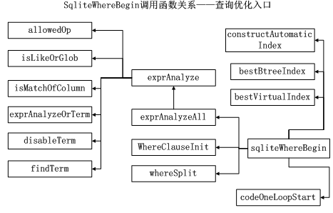
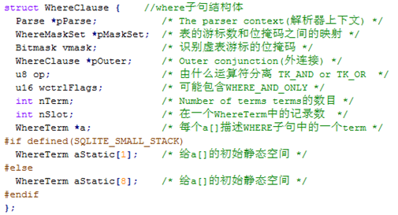
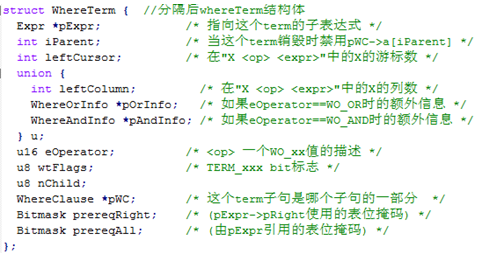
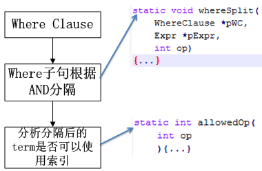
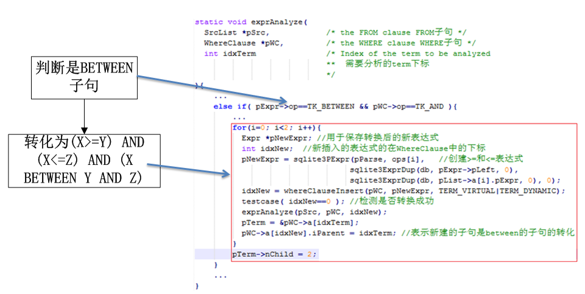
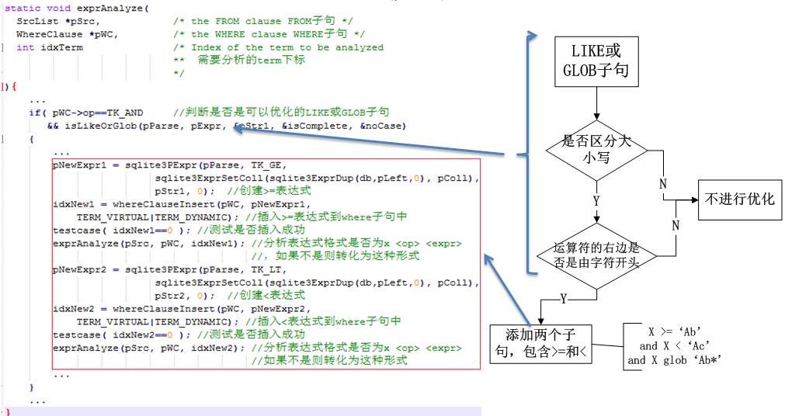
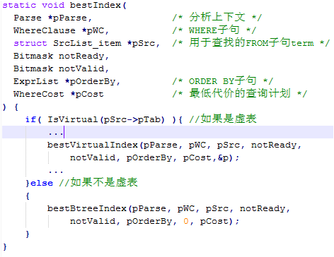
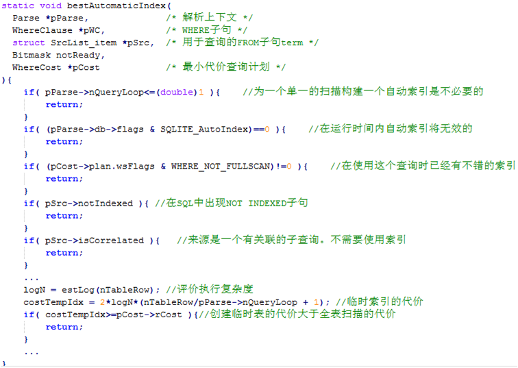

# where.c概述
一个单独的SQL命令,有可能会有几十,几百,甚至是几千种方法去完成那条命令,这取决于命令的复杂度和基本数据库模式.查询规划的任务就是从众多选择中选择一种能提供结果且磁盘I/O和CPU开销最小的算法.而where.c文件的主要功能就是生成VDBE编码来执行SQL命令中的WHERE子句,并且进行一定的查询优化处理.它是产生一个依次扫描一个表来查找合适的行.当合适的时候,选择索引并用它来加快查询——也就是查询优化.

# where.c的执行过程
where.c中首先把传递的where子句通过指定的op(可以是AND也可以是OR)进行分隔,把分隔后的语句放入到slot[]数组中,然后分别根据slot[]中的where子句别选择相应的优化操作,选择正确的索引.然后生成相应的VDBE编码,把数据清除并结束where操作.

例如:如果SQL是:
```sql
       SELECT * FROM t1, t2, t3 WHERE ...;
```
 那么会概念地生成以下代码:
```c
      foreach row1 in t1 do       \
        foreach row2 in t2 do      |-- 由sqlite3WhereBegin()生成
          foreach row3 in t3 do   /
            ...
          end                     \
        end                        |-- 由sqlite3WhereEnd()生成
      end                         /
```
where.c的执行基本流程如图:


# where.c中主要结构体和函数调用关系
接下来介绍where.c中主要结构体和函数调用关系.

## 主要函数调用关系

where.c中使用SqliteWhereBegin()函数是查询处理部分最核心的函数,它主要完成where部分的优化及相关的opcode的生成.

在SqliteWhereBegin()函数中,它接受从select,update,delete中传入的where子句,然后进行分析、优化,生成操作码,最后把操作码传递给VDBE后,使用SqliteWhereEnd()函数来生成WHERE循环的结束代码.

下面是where.c中的主要函数的调用关系:


其中:
    sqliteWhereBegin()函数是开始where子句的分析处理;
    WhereClauseInit()函数是初始化whereClause结构体;
    whereSplit()函数是把whereClause根据op分隔开来;
    codeOneLoopStart()函数是为WHERE子句中实现的的第i级循环的代码的生成;
    bestVirtualIndex()函数是用于计算虚拟表的最佳索引;
    bestBtreeIndex()函数是用于选择最佳的Btree索引;
    constructAutomatic()函数是用于创建自动索引;
    exprAnalyzeAll()函数是循环调用exprAnalyze()分析where子句;
    exprAnalyze()函数是分析分隔后的where子句;
    allowedOp()函数是判断相应的运算符是否可以使用索引;
    isLikeOrGlob()函数是判断like或glob语句是否能够进行优化;
    isMatchOfColumn()函数是检查表达式是否是column MATCH expr形式;
    exprAnalyzeOrTerm()函数是分析一个包含两个或更多OR子句连接的子句;
    disableTerm()函数是在WHERE子句中禁用一个被分割的子句;
    findTerm()函数是WHERE子句中查找一个被分割的子句;


其中:
    whereInfoFree()函数是释放whereInfo结构体;
    whereClauseClear()函数是解除一个WhereClause数据结构的分配;
    whereOrInfoDelete()函数是解除WhereOrInfo对象的所有内存分配;
    whereAndInfoDelete()函数是解除WhereAndInfo对象的所有内存分配


# 主要结构体

在where.c中,有两个比较重要的结构体:
一个是WhereClause结构体,它用于存储sql语句中的整个的where子句.


一个是WhereTerm结构体,它用于存储where子句根据op分隔后的各个语句.


它们之间的关系如下:


# where子句的查询优化

sqlite中大概有12种情况的优化分析,而在where.c文件中包含了其中8种.

这8种分别是:

1、where子句分析;
2、Between子句优化;
3、OR语句优化;
4、Like语句优化;
5、Skip-Scan优化;
6、多重索引的选择;
7、覆盖索引;
8、自动索引.

下面我们分别介绍这8种优化.

## WHERE子句分析

SELECT语句中如果存在WHERE子句,则对WHERE子句进行分析.首先根据AND关键字进行分割,之后对每个分割后的子句进行分析.对于分割后的子句,如果是以下情况:
```sql
column = expression
column > expression
column >= expression
column < expression
column <= expression
expression = column
expression > column
expression >= column
expression < column
expression <= column
column IN (expression-list)
column IN (subquery)
column IS NULL
```

那么这个子句是可以使用索引进行查询优化的.
如果定义一个索引:
```sql
CREATE INDEX idx_ex1 ON ex1(a, b, c, d, e,..., y, z);
```
那么如果索引中的初始列(列a, b等)出现在分割后的子句中,那么索引就会被启用,但是不能间断的使用索引列.如:WHERE子句中没有列c的约束,那么只有列a,b是可以使用索引的,其余的索引列都将无法正常使用.

执行步骤和程序实现如下:


## BETWEEN语句优化

如果被分割的子句包含BETWEEN语句,则把BETWEEN语句转化成两个不等式约束.
例如:
```sql
expr1 BETWEEN expr2 AND expr3
```
可以转化为:
```sql
expr1 >= expr2 AND expr1 <= expr3
```
转化后的语句只是用来分析,而不会产生VDBE代码.如果BETWEEN语句已经被编码,那么转化后的语句将会被忽略,而如果BETWEEN语句还未被编码且转化后的语句可以使用索引,那么系统将会跳过BETWEEN子句.

执行步骤和程序实现如下:


## OR语句优化
当分割的子句是OR子句连接时,有两种情况:

1.如果OR子句连接的各个子句都是在同一表上的同一列的等式约束,则可以使用IN语句来替换OR子句;

2.如果OR子句连接的各个子句不是在同一列上的约束并且如果各个子句的操作符是"=", "<", "<=", ">", ">=", "IS NULL", or "IN"中的一个,并且各个子句中的列是某些索引的初始列,那么就可以把这个OR子句概念上重写为UNION子句,并且每个列都可以使用相应的索引进行查询优化.

注:如果一个OR子句上述的两种情况都满足,则会默认使用第一种方式进行优化.

执行步骤和程序实现如下:


## LIKE语句优化
LIKE或GLOB语句进行优化时,需要满足一下条件:
1. LIKE或GLOB运算符的左边必须是有索引的列名且类型必须是TEXT类型的亲和类型;
2. LIKE或GLOB运算符的右边必须是一个字符串文字或一个绑定了字符串文字的参数,并且不能由通配符开头;
3. ESCAPE子句不能出现在LIKE运算符中;
4. 对于GLOB运算符,列必须使用内置BINARY核对序列排序;
5. 对于LIKE运算符,如果case_sensitive_like模式是启用的(也就是区分大小写的),那么列必须使用BINARY核对序列排列.
如果满足了上述条件,我们则可以添加一些不等式约束来减少LIKE或GLOB的查询范围.
例如:
```sql
x LIKE 'abc%'
```
添加条件后变为:
```sql
x >= 'abc' AND x < 'abd' AND x LIKE 'abc%'
```
这样x可以使用索引并且可以缩小LIKE的查询范围.

执行步骤和程序实现如下:


## Skip-Scan优化
普通的索引规则只有在WHERE子句中约束了最左边的索引列才起作用.然而,有些情况下——即使最初的几个索引列都没有在WHERE子句中使用,但而后的几列都包含在WHERE子句中,那么SQLite还是可以使用索引的.它的要求是需要进行ANALYZE分析,并且最左边的索引列有许多的重复值时,才可以使用基于索引的Skip-Scan.

例如:
```sql
CREATE TABLE people(
 name TEXT PRIMARY KEY,
 role TEXT NOT NULL,
 height INT NOT NULL, -- in cm
 CHECK( role IN ('student','teacher') )
);
CREATE INDEX people_idx1 ON people(role, height);
```

people表中的role字段只有"student"和"teacher"两种取值,虽然role被加上了索引,但其并不具有选择性,因为它只包含两种取值.
考虑下面这个查询:
```sql
SELECT name FROM people WHERE height>=180;
```
按照普通的索引规则,会认为索引不可用,实际上SQLite会使用索引.SQLite会把上述查询概念的转化为:
```sql
SELECT name FROM people
 WHERE role IN (SELECT DISTINCT role FROM people)
AND height>=180;
```
或是这种:
```sql
 SELECT name FROM people WHERE role='teacher' AND height>=180
UNION ALL
 SELECT name FROM people WHERE role='student' AND height>=180;
```
这样索引就可以使用,这样也会比全表扫描要快一些.
注意:Skip-Scan只对重复值大于或等于18时有用,如果没有分析数据库,那么Skip-Scan就不会永远被使用.

## 多重索引的选择
SQLite中,一般情况下(除了OR子句的优化查询外),对于每一个表,在查询的FROM子句中至多使用一个索引,并且SQLite努力在每个表中使用至少一个索引.而很多的表中,会创建多个索引,SQLite需要判断使用哪个索引较为合理.

SQLite在面临多个索引的选择是,它会试图评价每种方案执行查询时使用的工作总额.然后它选出一种工作总而最少的方案.而使用ANALYZE命令可以帮助SQLite更加精确的评估使用多种索引的工作情况.

当然SQLite也提供了手动取消索引的方法,就是在WHERE子句中的索引列前加上"+"来阻止使用该索引列.如:

```sql
SELECT z FROM ex2 WHERE +x=5 AND y=6;
```
上述例子中就手动的取消了x上的索引.

对于范围查询,当SQLite被SQLITE_ENABLE_STAT3或SQLITE_ENABLE_STAT4编译后,如果某列的查询空间缩减倍数较大,并且该列是一个索引列,那么SQLite就会使用该索引.因为SQLITE_ENABLE_STAT3或SQLITE_ENABLE_STAT4选项会使ANALYZE命令来收集在sqlite_stat3或sqlite_stat4表中一个关于列内容的直方图,并且使用这个直方图来更好的分析范围查询,并且选择最好的查询优化.对于STAT3记录的直方图数据只有最左边的索引列,而STAT4记录的直方图数据时所有的索引列.所以,对于只有一个索引列的情况,STAT3和STAT4的工作结果是相同的.但是,如果范围约束的列不是最左边的索引列,那么STAT3收集的信息对于选择索引来说将是无用的.

程序实现如下:


## 覆盖索引
在SQLite中,做一个索引查找时,查找一行通常是在索引上做一个二分查找来查找索引项,然后从索引中提取rowid并且使用rowid在原始表上做二分查找.所以,一个典型的索引查找包含两个二分查找.然而,如果从表中取出的所有列在索引中都是可以得到的,SQLite会使用索引中包含的值,并且不会查找原始表中的行.这为每一行节约了一个二分查找并且可以让多数的查询运行速率提高一倍.
当一个索引包含查询所需要的所有数据并且原始表不再被请求时,我们称这种索引为"覆盖索引".
程序实现如下:


## 自动索引
SQLite会在一定情况下创建一个自动索引用于帮助提高一个查询的效率,这个自动索引值在当前的SQL语句中被使用.SQLite构造自动索引的代价是O(NlogN)(其中N是表中的项目数).因为做一个全表扫描的代价是O(N),所以,SQLite只会在希望SQL语句中运行的查找多余logN次时,才被创建.SQLite中自动索引默认是启用的,但SQLite支持手动关闭自动索引,设置automatic_index pragma来使它停用.
程序实现如下:


选择是否使用自动索引:


# wherecSummary
SQLite中的查询优化虽然较为简单,但也对大多数情况进行了分析优化.在SQLite查询优化中,很多情况下是需要使用ANALYZE进行分析、统计的,这会让SQLite较为容易的选择正确的优化策略,并且会让SQLite选择更加优秀的优化策略.同时SQLite支持用户自定义一些优化策略(如:多重索引选择,自动索引等),用户在使用SQLite时,如果遇到可以自定义的情况,请根据实际情况进行选择,这也使得SQLite优化策略显得较为灵活.
