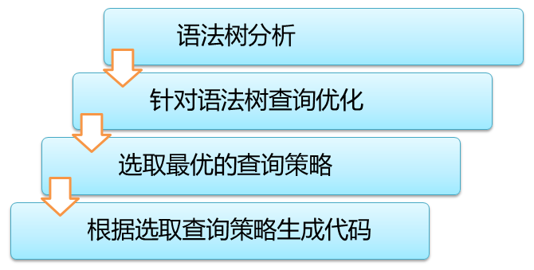

# 查询优化器
查询优化器的工作就是将一个内部的查询表示转化为一个高效的查询执行计划.一个查询计划可以被认为是一个数据流图,在这个数据流图中,表数据会像在管道中传输一样,从一个查询操作符(operator)传递到另一个查询操作符.在许多系统里,查询首先被分解为SELECT-FROM-WHERE查询块.每个单独的查询块的优化都是使用一些技术来完成的,这些技术与Selinger等人在System R 优化器的论文中描述的技术类似.在完成的时候,一些简单的操作符通常被添加到每个查询块的顶部,作为后处理来计算GROUP BY,ORDER BY,HAVING和DISTINCT子句.然后,不同的块就用一种简单的方式拼合在一起.

## SQLite 查询优化流程



1. 语法树分析:根据词法分析器Paser分析出的Where部分语法树进行分析,查询可进行优化的部分;

2. 针对语法树查询优化:对每种可以进行优化的Where语句结构进行优化;

3. 选取最优的查询策略:针对Where中每个表选取查询扫描策

4. 根据选取查询策略生成代码:最后根据分析及优化的结果生成VDBE虚拟机的操作码OPCode.

## SQLite中几种查询优化做的处理
* SQLite中可用索引的操作

SQLite在处理查询的时候有些语句是不可使用索引的:

1.	操作符:=、>、<、IN等,若操作的属性上有索引,则可以使用;
2.	操作符BETWEEN、LIKE不能用索引.

所以针对某些情况SQLite会进行查询优化使之尽可能的可以使用索引来进行查询.

* BETWEEN语句处理

>原语句:`expr1 BETWEEN expr2 AND expr3 `

```text
    由于BETWEEN语句无法直接使用索引,所以为了尽可能的使用索引,SQLite在该语句后添加了虚项Virtual Terms:expr1 >= expr2 AND expr1 <= expr3.
```


        Virtual Terms被设置为BETWEEN的子句,如果BETWEEN语句已经编码,那么就忽略子句;如果存在可以使用的索引,则忽略BETWEEN语句,使用AND连接的查询条件处理.

---------------------------------------

* OR语句的特殊情况


>原语句(不可用索引):`column = expr1 OR column = expr2 OR column = expr3 OR ...`


        针对这种同一个属性的许多等值判断用OR连接起来的语句,SQLite中直接转换为如下形式:column IN (expr1,expr2,expr3,...).
        这样可以尽量使用列Column上的索引并且减少查询代价.

---------------------------------------
* LIKE语句处理

>原语句:`column LIKE ‘x%’`


        针对这种LIKE语句,SQLite在该语句后添加了虚项Virtual Terms:column >= x AND column < y,其中y与x的长度相同,且除了最后一个字符其他字符相同,y的最后一个字符的ASCII码为x最后一个字符的ASCII码加一.
        例如X LIKE ‘abc%’添加Virtual Terms:X >= ‘abc’ AND X < ‘abd’

## 查询扫描策略

在SQLite中对表的查询扫描策略有如下几种方式:
1.	全表扫描,一般在不使用Where语句时使用;
2.	基于索引扫描,在查询的表有索引并且Where语句中的条件可以使用该索引时使用;
3.	基本RowId的扫描,在Where查询条件中含有RowId时使用.

## 查询策略代价模型及计算方式

SQLite中计算一个查询策略的代价主要考虑查询记录的数量、是否排序以及是否需要访问索引和原表.
```c
    struct WhereCost {
        WherePlan plan;  /* 策略计划 */
        double rCost;    /* 该查询计划的总成本bestBtreeIndex函数中计算 */
        Bitmask used;    /* Bitmask of cursors used by         this plan */
    };
```
查询代价计算方式:
* 无可用索引,则查找是否有查询RowId的条件.


①	类似Rowid=EXPR的条件,代价0,记录数1;
②	类似RowId IN(),IN括号中为给出列表,估计代价NLogN,N为IN中的元素个数,记录数N;
③	类似RowId IN(),IN括号中为子查询,估计代价200,记录数100;
④	RowId的范围查询,代价记录数为总记录数三分之一;
⑤	全表查询,估计代价记录数乘4;
⑥	若SQL语句包含ORDER BY,代价乘NLogN.
*	有可用索引,统计每个表索引信息.

①	操作符为=或IN,=操作符没有附加代价.IN操作符中,若是子查询的附加代价为25,给出列表的附加代价为元素数N;
②	索引范围查询,记录数除3,估计代价除3;
③	若SQL语句包含ORDER BY,代价乘NLogN.

## SQLite中查询优化方式的总结

SQLite作为一个微型嵌入式数据库,一般使用在单个设备上,并且通常数据量不会很大,所以SQLite中的查询优化相对来说比较简单.主要是通过分析处理语法树使之尽可能地使用索引,然后基于查询策略代价优化来完成整个查询优化.

