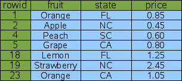
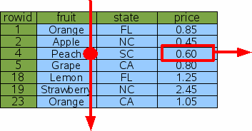
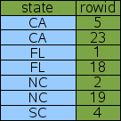
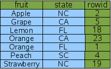
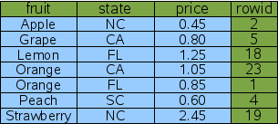
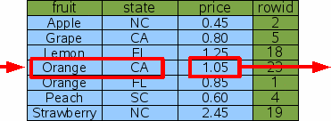
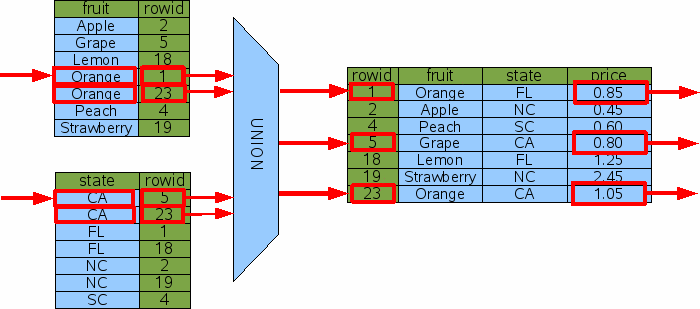
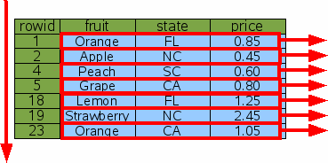
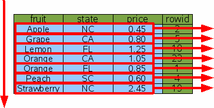
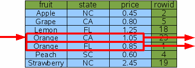

## 0x00 概览

SQL是一门声明式语言。这意味着，当使用SQL进行编程的时候，你希望告诉数据库，你想要的是什么，而不是告诉数据库如何去计算。**如何去计算**这个任务，交给了SQL数据库引擎中的查询计划系统（query planner subsystem）处理。

对于一个指定的SQL语句，可能有成千上万种计算方式去执行它。所有的这些方式都会得到正确的答案，但是其中一些会运行得更快。你可以把查询计划系统当作一个小机器人，它想要做的事情就是对于指定的SQL语句，找到其中最快速最高效的执行方式。

大多数时候，查询计划系统都做得不错。但是有时候，这个小机器人需要一些额外的信息，例如索引，来帮助他们更好地工作。这些额外信息一般都是由程序员添加到数据库中的。在有些情况下，程序员需要去手动添加这些额外信息，来帮助查询计划系统更好地完成任务。

这篇文档说明了SQLite查询计划引擎是如何工作的。程序员可以用这些信息，创建更有用的索引，同时为查询计划引擎提供更多有用的查询指引。

## 0x10 查找

### 0x11 没有索引的表格

在SQLite中，表格包含零条或多条数据，每一条数据都有唯一标识，标识可以是行号(rowid)或者其他主键(INTEGER PRIMARY KEY)，数据在磁盘中以行号升序的顺序排列。

举个例子，这篇文章使用一个叫`FruitForSale`的表格，表述了不同品种的水果，以及它们的出生地和价格。

```sql
CREATE TABLE FruitsForSale(
	Fruit TEXT,
	State TEXT,
	Price REAL
);
```

加入一些随机数据，这样的一个表在磁盘中可能是以这样的形式存在的：



在这个例子中，行号不连续，但是以升序排列。SQLite一般从1开始创建行号，每新增一条数据，则行号加一。如果数据被删除，则可能出现这种行号不连续的情况。行号可以被指定，所以新增的数据不一定会被插入到表格的底部。但是不管发生了什么，行号总是独一无二且严格升序的。

假设你想查询桃子的价格，查询语句对应是：

```sql
SELECT price FROM fruitsforsale WHERE fruit='Peach';
```

为了执行这条语句，SQLite会读取表格中的所有数据，检查`fruit`这个属性是否等于`Peach`，如果相等，则输出那一行的`price`属性。图二展示了这个过程。

这个算法被称为全表扫描(full table scan)，表中所有的内容都必须被读取出来并进行检查。当表中只有七行数据时，全表扫描是可接受的；但是当表中包含七百万条数据时，为了找到一个8比特的数字，表中数兆的数据都会被读取出来。因为这个原因，一般都会尽力避免全表扫描。



### 0x12 用行号查询

使用行号进行查询可以避免全表扫描。为了找到桃子的价格，你可以直接找`rowid = 4`的数据：

```sql
SELECT price FROM fruitsforsale WHERE rowid=4;
```

因为所有的数据在磁盘中以行号升序排列，SQLite可以用二分查找的方式找到正确的数据。如果一个表格包含`N`个元素，则寻找到所需数据的耗时是`logN`数量级的。相对应，全表扫描则是`N`数量级的。如果一个表格中包含了一千万个元素，二分查找的查询方式比全表扫描快上了`N/logN`倍，也就是一百万倍。


### 0x13 用索引查询

用行号查询的问题在于，你不关心第四条数据是什么，你只想知道桃子的价格，所以用行号查询没什么用。

为了使得原本的查询更加有效，我们在`fruit`这个属性上添加索引：

```sql
CREATE INDEX Idx1 ON fruitsforsale(fruit);
```

索引也是一个表格，但是是以索引字段升序排列的，并且最后一个属性是行号。图四展示了`Idx1`在磁盘中的样子。`fruit`属性用来对索引表中的内容进行排序，rowid是第二个属性，把索引和原表格联系起来。因为`rowid`对于每一个数据是独一无二的，`fruit`和`rowid`的组合同样也是对每一个数据独一无二。


新的索引可以用来帮助SQLite更快地查询到桃子的价格。

```sql
SELECT price FROM fruitsforsale WHERE fruit="Peach";
```

首先，在`Idx1`中使用二分查找找到桃子。SQLite可以在`Idx1`中使用二分查找，这是因为`Idx1`是以`fruit`的内容被排序的。在`Idx1`中找到了桃子之后，数据库引擎会找到对应的`rowid`。然后数据库引擎会在原来的表格中使用`rowid`进行第二次二分查找，并输出对应的价格。这个过程在图五中被展示出来。


为了找到桃子的价格，SQLite必须使用两次二分查找。对于一个非常大的表格，这种方式比全表扫描要快得多。

### 0x14 查询结果包含多个数据

在之前的查询中，结果只有一行。同样的算法可以应用于结果有多行的查询。现在我们来查询橙子的价格：

```sql
SELECT price FROM fruitsforsale WHERE fruit='Orange'
```


在这种情况下，SQLite在索引表中进行一次二分查找，首先找到第一条`fruit`属性是橙子的数据。然后使用行号在原始的数据表中找到价格并输出。数据库引擎接着检查索引中的下一条数据，并同样输出价格。对于数据库引擎来说，直接查找下一条数据，比重新进行一次二分查找要省时省力得多，以至于我们可以直接忽略。所以在这个输出结果有两行的情况下，数据库进行了三次二分查找。

### 0x15 多个AND连接的WHERE语句

接下来，我们想查询的是在加州长大的橙子的价格。查询语句如下：

```sql
SELECT price FROM fruitsforsale WHERE fruit='Orange' AND state='CA'
```


一种方式是，先在索引中找到所有橙子的数据，然后使用行号在原始数据表中找到数据，并过滤掉那些不符合要求的数据。这个过程如图7所示。在大多数场景下，这种方式是非常合理的。当然，数据库引擎进行了一次额外的二分查找，因为后续有一条数据被过滤掉了。

如果这个时候除了在`fruit`属性上，在`state`属性上也建立了索引。

```sql
CREATE INDEX Idx2 ON fruitsforsale(state);
```



`state`索引跟`fruit`索引一样，是一个额外的表格，包含`state`属性和行号，并按照`state`属性排序。在我们的数据中，存在多个`state`，它们由行号来被区分。

使用新的索引`Idx2`，SQLite有了另一个找到加州橙子价格的执行方案：先在索引中找到加州，然后过滤掉那些不是橙子的数据。


使用`Idx2`或者`Idx1`会导致SQLite检查不同的数据，但是最终得到的结果是一样的，同时在这个例子中，工作量是一样的。所以`Idx2`在这种情况下对性能的提升没有帮助。

### 0x16 多属性索引

为了在AND连接的WHERE语句中得到更好的性能，可以使用多属性索引。在这个例子中，我们可以在fruit和state上创建一个新索引：

```sql
CREATE INDEX Idx3 ON fruitsforsale(fruit, state);
```



多属性索引跟单属性索引一样，被索引的属性被放在前面，最后加上行号。唯一不同的是，现在多个属性被加到了索引表中。最左边的属性被用来对整个索引表进行排序。

有了新的`Idx3`索引表，现在就可以仅仅使用两次二分查找来找到加州橙子的价格。

```sql
SELECT price FROM fruitsforsale WHERE fruit='Orange' AND state='CA'
```


因为`Idx3`中有fruit和state两个属性，即WHERE中的两个限制属性，所以SQLite可以使用一次二分查找找到加州橙子的行号。这里没有被过滤掉的数据行，所以这个查询更高效。

注意到，Idx3中有和Idx1中一样的数据。所以如果有了Idx3，我们就不再需要Idx1了。可以利用Idx3来查找桃子的价格：

```sql
SELECT price FROM fruitsforsale WHERE fruit='Peach'
```


所以，如果存在这种索引重复的情况下，应该删除掉属性更少的索引。在这个例子中，`Idx3`和`Idx1`即为重复，应该删除掉属性更少的`Idx1`。

### 0x17 覆盖索引

使用两个属性的索引，可以使查询加州橙子的价格更高效。但是SQLite可以做的更好，如果存在包含`price`的三属性索引。

```sql
CREATE INDEX Idx4 ON fruitsforsale(fruit, state, price);
```



这个新的索引包含原始表中的所有属性。对于加州橙子价格这个查询来说，`Idx3`索引同时包含了约束条件和输出结果，我们称其为覆盖索引。因为所有的信息都存在于覆盖索引中，所以SQLite不需要去原来的数据表中进行查询。

```sql
SELECT price FROM fruitsforsale WHERE fruit='Orange' AND state='CA';
```



当把这个输出属性加入到索引中之后，SQLite只需要进行一次二分查找来找到最终的结果。

当然值得注意的是，这里只是将查询速度加快了一倍。在第一次加入查询时，将全表扫描变为了二分查找，那个提升显然更大。1ms和2ms的差别并没有那么大。

### 0x18 OR连接的WHERE语句

多属性的索引仅仅在AND连接的查询中生效。所以Idx3和Idx4在查询橙子**和**在加州生长这个条件时很有用，但是在查询橙子**或**在加州生长这个条件时没有帮助。

```sql
SELECT price FROM FruitsForSale WHERE fruit='Orange' OR state='CA';
```

当遇到OR连接的WHERE查询时，SQLite会分别检查每一个条件，然后取并集得到最终的结果。如下图所示，



上图暗示着，SQLite会首先计算出所有的行号，然后再对得到的行号求并集，最终去原始数据表格中查询数据。但是实际上，行号的计算和在原表数据的查询在时间上是交错在一起的。SQLite得到某个行号后会立即去原表中查询数据，并记下这个行号，在之后如果计算得到同样的行号则直接忽略。当然，这只是实现上的小细节。不管怎么说，上图很好的表述了在查询OR连接的WHERE语句时发生了什么。

为了使这种查询变得高效，必须为每一个OR连接的条件创建一个索引。如果有一个条件没有对应的索引，那么就会触发全表扫描。如果SQLite必须做全表扫描，那么对于其他的条件也不必再去查询索引了，所有的结果会在同一次全表扫描中得到。

## 0x20 排序

SQLite同样可以使用索引来进行更快的排序。

当没有合适的索引时，排序需要一个额外的步骤来完成。考虑这个查询：

```sql
SELECT * FROM fruitsforsale ORDER BY fruit;
```

SQLite首先会拿到所有的输出数据，然后对其进行排序，并输出：


如果输出数据有`K`个，那么排序的时间就正比于`KlogK`。如果`K`比较小，那么排序时间就不是一个限制因素。但是当`K == N`时，排序所需要的时间就比全表扫描的时间还要多。而且，整个输出会在内存中暂存，这意味着会花费很多额外的内存来完成这个查询。

### 0x21 使用行号进行排序

因为排序是一件非常耗时的操作，在实现SQLite时，花费了大量工作希望把排序消除掉。如果SQLite发现输出本来就是按照指定排好序的，那么就不用再额外进行排序步骤。例如，如果希望将输出以行号来排序，那么就不需要再做一次排序了。

```sql
SELECT * FROM fruitsforsale ORDER BY rowid;
```



也可以倒序查询：

```sql
SELECT * FROM fruitsforsale ORDER BY rowid DESC;
```

SQLite同样会省略排序步骤。但是为了在结果中保持顺序，SQLite会从表格的底部开始扫描，一直到表格的开始。

### 0x22 利用索引排序

当然，对行号进行排序没什么用。更常见的情况是，使用某个属性对结果进行排序。

如果对排序的属性存在索引，这个索引可以用来进行排序。考虑下面这个排序：

```sql
SELECT * FROM fruitsforsale ORDER BY fruit;
```


从头到尾扫描`Idx1`，即可按序找到所有数据的行号。然后对于每一个行号，使用二分查找就可以从原始表格中取出数据。这样输出就是想要的顺序了，而不需要进行额外的排序步骤。

这个算法真的节省了时间吗？原来的找数据然后再排序耗时正比于`NlogN`。现在这里使用`Idx1`，必须要做`N`个`logN`的查询，所以总耗时也是正比于`NlogN`。

但是一般来说SQLite会选择基于索引的查询，因为这个算法所需的内存要远小于基于排序的算法。

### 0x23 利用覆盖索引排序

如果对于一个查询，可以使用覆盖索引，那么原始表格的查询就可以被避免，进而大幅提升查询的性能。



使用覆盖索引，SQLite可以从头到尾遍历一次索引，这样的时间损耗正比于`N`，而且不需要消耗很多内存。

## 0x30 查找并排序

之前的讨论将查找和排序分别看待。但是实际上，查找和排序时常同时发生。幸运的是，可以使用索引来同时完成查找和排序。

### 0x31 使用多属性索引查找并排序

假定我们想找到所有的橙子，并以生长的州进行排序，查询语句是：

```sql
SELECT price FROM fruitforsale WHERE fruit='Orange' ORDER BY state
```

这个查询包含了一个被`WHERE`语句限制的查询，以及排序。使用两个属性的索引`Idx3`，这两个任务可以同时被完成。


这个查询首先在索引中以二分查找的方式找到橙子，然后使用行号在原始的数据表格中找到价格并输出。

这里没有排序的操作，因为在索引中，对于同一个`fruit`，数据已经是按照`state`进行排序了。

### 0x32 使用覆盖索引查找并排序

覆盖索引可以被用来查找同时排序。考虑以下的查询：

```sql
SELECT * FROM fruitforsale WHERE fruit='Orange' ORDER BY state
```



### 0x33 块排序

有时只有一部分的排序可以被索引满足。考虑以下的查询：

```sql
SELECT * FROM fruitforsale ORDER BY fruit, price
```

如果覆盖索引被用来辅助这个查询，fruit属性是已经排序好的，但是price不是。当这种情况发生时，SQLite会做一个小型的排序来保证正确的顺序，如下图所示：


在这个例子中，只需要对两行数据进行排序。相对于对所有的数据进行排序，这种方式有几个优点：

1. 多个小的排序消耗的CPU时钟周期更少；
2. 每个小的排序独立执行，因此每次使用的内存都相对少很多；
3. 有一些属性已经排列好了，减少了计算量；
4. 如果有一个LIMIT限制，则可以避免全表扫描。

基于以上优势，如果没有可以被索引完全排序的情况下，SQLite总是会优先使用块排序。